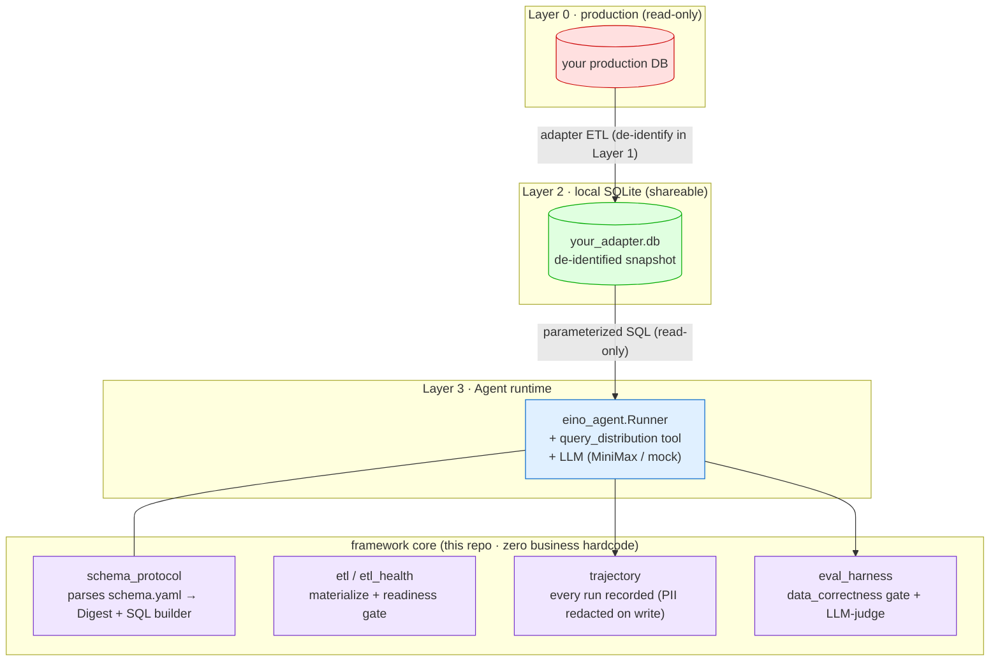

# schema-driven-insight-agent

**English** | [简体中文](README.zh-CN.md)

**A schema-driven data-insight AI agent framework.** Point it at a new dataset by writing one `schema.yaml` and a thin adapter — the agent answers natural-language operational questions with distribution tables **and proactive insights**, never touching your production database directly.

> Built for game-operations analytics, but the core carries **zero business hardcoding** — all domain knowledge lives in the adapter's `schema.yaml`. Swap the schema, get a new analyst.

---

## Why

Most "chat with your data" tools either (a) let an LLM write raw SQL against prod (unsafe, unauditable), or (b) hardcode one schema (not portable). This framework takes a third path:

- **Schema-driven, zero business hardcode** — the engine knows *nothing* about your domain. A YAML `schema.yaml` declares tables, columns, roles, PII flags, and distribution buckets. The same binary serves any adapter.
- **Three-layer data flow** — the agent only ever reads a local, de-identified SQLite snapshot. It **never** connects to production Postgres.
- **Structured tool, not free-form SQL** — the agent calls a parameterized `query_distribution` tool with a column/bucket whitelist; SQL is built by the framework, not the LLM.
- **Proactive insight** — beyond the distribution table, the agent surfaces operational takeaways (churn cliffs, whale concentration, server skew).
- **Trajectory + Eval from day one** — every run is recorded; an eval harness gates `data_correctness` deterministically.

## Quickstart (30 seconds, no API key, no database)

```bash
git clone https://github.com/RuntianLee/schema-driven-insight-agent
cd schema-driven-insight-agent/examples/toygame

# 1. Generate a synthetic Layer-2 snapshot (1000 fake players, pure Go, no PG)
go run ./cmd/seed

# 2. Ask the agent a question (run from the repo root so default paths resolve)
cd .. && cd ..
go run ./cmd/agent -q "玩家的金币余额分布是怎样的？"
```

Without `MINIMAX_API_KEY` set, the answer falls back to a stateless **mock placeholder** — the tool/SQL path still executes on the real synthetic data, but the mock reply doesn't render it. Set a provider key (see `config/llm.example.yaml`) to get the real distribution table **and** proactive insight in the answer.

## Architecture

The core discipline: **the agent never touches production. Data only flows up.**



**Read it:** the agent only reaches the green "shareable" SQLite layer. De-identification happens in the adapter's ETL (Layer 1), so Layer 2 is compliant-by-construction. The framework builds every SQL string from the schema with a column/operator whitelist — the LLM never emits SQL.

## How it works

1. **Write a `schema.yaml`** declaring your `state_tables` (columns, `role`, `pii`, `omit_in_layer2`) and `glossary.buckets` (distribution segments).
2. **Write a thin adapter** that materializes a Layer-2 SQLite snapshot — either a real Postgres ETL (`framework/etl` has read-only pgx helpers) or a synthetic seed (see `examples/toygame`). This is typically **under 200 lines**.
3. **Run the agent** against that snapshot. It parses your schema into a "Digest" (what the LLM is told it can ask), routes tool calls through the whitelisted SQL builder, and narrates the result.

The repo ships a complete, runnable example: [`examples/toygame`](examples/toygame) — a fictional idle game with synthetic data. Use it as the template for your own adapter.

## Write your own adapter

See **[docs/ADAPTER_GUIDE.md](docs/ADAPTER_GUIDE.md)** — a step-by-step guide using `examples/toygame` as the scaffold.

## Repository layout

```
schema_protocol/   schema.yaml parser + Digest + whitelisted SQL builder
tools/             query_distribution tool (the agent's only data tool)
eino_agent/        agent runner (LLM tool-calling loop)
agent/             agent contract (interfaces; engine-agnostic)
contract/          response types (distribution rows, profile)
etl/ etl_health/   generic ETL helpers + startup readiness gate
trajectory/        run recording (PII redacted on write)
eval_harness/      eval engine: data_correctness + LLM-judge evaluators
llm/               LLM client resolution (MiniMax; mock fallback)
prompts/           methodology system prompt (no business data)
cmd/agent/         the CLI entry point (REPL + single-shot)
examples/toygame/  runnable synthetic example adapter (start here)
```

## Status

Early open-source release. The framework core is stable; the API may still evolve before a tagged `v1`. Adapters for real datasets (and their data) are intentionally **not** part of this repository.

## License

MIT — see [LICENSE](LICENSE). The adapter layer and any real data live outside this repository.
