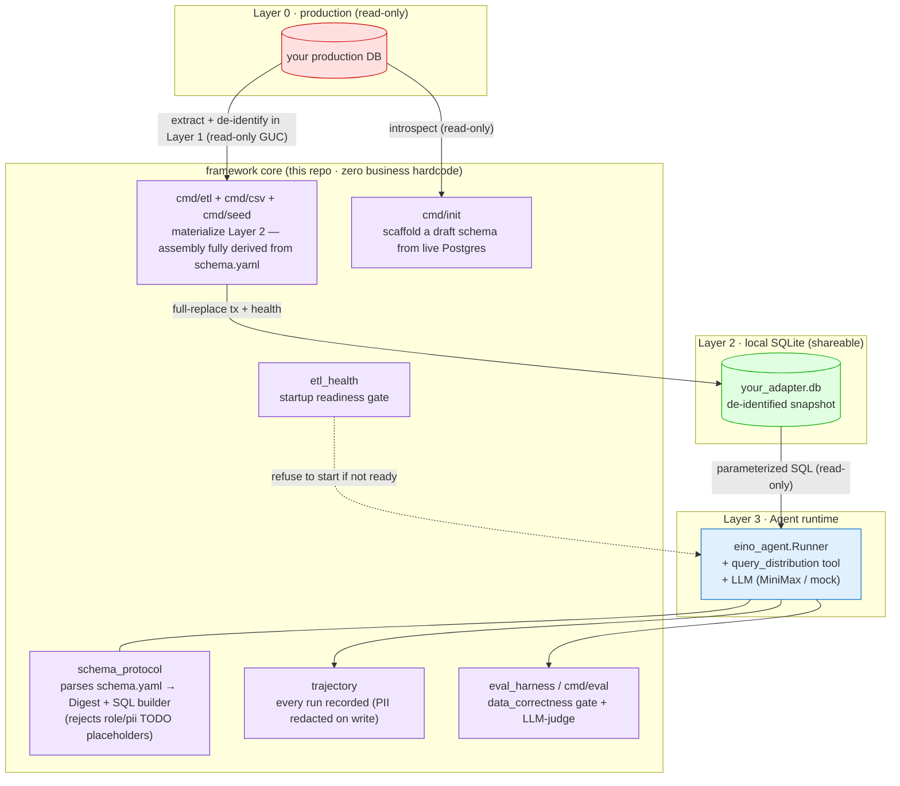

# schema-driven-insight-agent

**English** | [简体中文](README.zh-CN.md)

**A schema-driven data-insight AI agent framework.** Point it at a new dataset by writing one `schema.yaml` and a db config — **zero Go code** — the agent answers natural-language operational questions with distribution tables **and proactive insights**, never touching your production database directly.

> Built for game-operations analytics, but the core carries **zero business hardcoding** — all domain knowledge lives in the adapter's `schema.yaml`. Swap the schema, get a new analyst.

---

## Why

Most "chat with your data" tools either (a) let an LLM write raw SQL against prod (unsafe, unauditable), or (b) hardcode one schema (not portable). This framework takes a third path:

- **Schema-driven, zero business hardcode** — the engine knows *nothing* about your domain. A YAML `schema.yaml` declares tables, columns, roles, PII flags, and distribution buckets. The same binary serves any adapter.
- **Three-layer data flow** — the agent only ever reads a local, de-identified SQLite snapshot. It **never** connects to production Postgres.
- **Structured tool, not free-form SQL** — the agent calls a parameterized `query_distribution` tool with a column/bucket whitelist; SQL is built by the framework, not the LLM.
- **Proactive insight** — beyond the distribution table, the agent surfaces operational takeaways (churn cliffs, whale concentration, server skew).
- **Trajectory + Eval from day one** — every run is recorded; an eval harness gates `data_correctness` deterministically.

## Quickstart (30 seconds, no API key, no database)

```bash
git clone https://github.com/RuntianLee/schema-driven-insight-agent
cd schema-driven-insight-agent

# 1. Build a de-identified Layer-2 snapshot from a real CC0 CSV (zero Go, no PG).
#    CustomerId is hashed and Surname dropped — all derived from schema.yaml.
go run ./cmd/csv -schema examples/bankchurn/schema.yaml

# 2. Ask the agent a question
SCHEMA_PATH=examples/bankchurn/schema.yaml \
SQLITE_PATH=examples/bankchurn/data/churn.db \
ETL_HEALTH_PATH=examples/bankchurn/data/etl_health.json \
go run ./cmd/agent -q "银行客户的账户余额分布是怎样的？"

# 3. Run the deterministic eval gate (no API key needed)
go run ./cmd/eval -schema examples/bankchurn/schema.yaml \
  -tasks examples/bankchurn/eval/tasks -db examples/bankchurn/data/churn.db
```

`examples/bankchurn` is a **real** public dataset (Kaggle Bank Customer Churn, CC0, 10k rows) wired in with **zero Go** — `schema.yaml` only. Prefer synthetic data, or have no CSV to hand? `examples/toygame` shows the declarative `cmd/seed` path: `go run ./cmd/seed -schema examples/toygame/schema.yaml -spec examples/toygame/seed.yaml`.

Without `MINIMAX_API_KEY` set, the answer falls back to a stateless **mock placeholder** — the tool/SQL path still executes on the real data, but the mock reply doesn't render it. Set a provider key (see `config/llm.example.yaml`) to get the real distribution table **and** proactive insight in the answer.

## Architecture

The core discipline: **the agent never touches production. Data only flows up.**



**Read it:** the agent only reaches the green "shareable" SQLite layer. De-identification happens inside the generic `cmd/etl` (Layer 1) whose entire assembly — columns, currency pivot, indexes, salt, row gates — is derived from your `schema.yaml`, so Layer 2 is compliant-by-construction and there is no adapter code to audit. The framework builds every SQL string from the schema with a column/operator whitelist — the LLM never emits SQL.

## How it works

1. **Write a `schema.yaml`** declaring your `state_tables` (columns, `role`, `pii`, `omit_in_layer2`), `glossary.buckets` (distribution segments), and an `etl_policy` block — or let **`cmd/init`** introspect your Postgres and generate a draft (it leaves `role`/`pii` as TODO placeholders that the parser refuses to run until you annotate them: forgetting to mark PII is mechanically impossible).
2. **Materialize a Layer-2 SQLite snapshot with zero Go** — point `cmd/etl` at a real Postgres (read-only extraction, de-identified in flight), `cmd/csv` at a CSV file (e.g. a Kaggle export — treated as Layer-1 and de-identified the same way, see `examples/bankchurn`), or `cmd/seed` at a declarative `seed.yaml` (synthetic data, see `examples/toygame`). Three on-ramps, one uniform connection. No adapter code to write.
3. **Run the agent** against that snapshot. It parses your schema into a "Digest" (what the LLM is told it can ask), routes tool calls through the whitelisted SQL builder, and narrates the result.

The repo ships two runnable examples, both YAML-only (zero Go): [`examples/bankchurn`](examples/bankchurn) — a **real** CC0 dataset via the CSV lane (start here) — and [`examples/toygame`](examples/toygame), a synthetic idle game via the `cmd/seed` lane.

## Write your own adapter

See **[docs/ADAPTER_GUIDE.md](docs/ADAPTER_GUIDE.md)** — a step-by-step guide using `examples/toygame` as the scaffold.

## Security model

What the framework guarantees, and where the trust boundary sits:

- **`schema.yaml` is the trust boundary.** It is authored by the adapter developer and treated as trusted input — but defensively validated anyway: table/column names must match `^[A-Za-z_][A-Za-z0-9_]*$`, bucket labels are quote-escaped before inlining, and every identifier must pass the schema whitelist before reaching SQL.
- **The LLM never emits SQL.** It emits structured tool arguments; SQL is built by the framework with filter values bound as `?` parameters and a fixed operator whitelist.
- **PII is enforced on three faces with one rule.** Columns marked `pii` / `omit_in_layer2` are rejected at query build time, never materialized into Layer 2, and never shown in the schema digest fed to the LLM.
- **The agent never touches your production DB.** It reads only the Layer-2 SQLite snapshot; the ETL side connects read-only (`default_transaction_read_only` + statement timeout).
- **Trajectories are redacted on write** (questions, steps, and final outputs) and `trajectory.db` is gitignored. API keys load from env / gitignored config and are never logged.
- **Known injection surface:** tool results (including `CAST AS TEXT` values of DB text columns) are fed back into the LLM conversation. With numeric game data this is inert; if your adapter exposes user-generated TEXT columns (nicknames, signatures), their content reaches the prompt — mark such columns `pii`/`omit_in_layer2`, or expose them deliberately and treat the narration as untrusted.

## Repository layout

```
schema_protocol/   schema.yaml parser (etl_policy / index / TODO safety gate) + Digest + whitelisted SQL builder
tools/             query_distribution tool (the agent's only data tool)
eino_agent/        agent runner (LLM tool-calling loop)
agent/             agent contract (interfaces; engine-agnostic)
contract/          response types (distribution rows, profile)
etl/               generic ETL: schema-derived assembly (derive), orchestration (RunAll)
etl/seedgen/       declarative synthetic data generator (seed.yaml → deterministic snapshot)
etl/csvload/       CSV file → de-identified Layer-2 (mirrors seedgen; bring your own CSV)
etl/introspect/    Postgres introspection + adapter-draft rendering (cmd/init core)
etl_health/        startup readiness gate (min_rows / frozen / data_as_of)
trajectory/        run recording (PII redacted on write)
eval_harness/      eval engine: data_correctness + LLM-judge evaluators; evalcli shared assembly + inline YAML fixtures
llm/               LLM client resolution (MiniMax; mock fallback)
prompts/           methodology system prompt (no business data)
cmd/init/          scaffold a new adapter from a live Postgres (draft with TODO placeholders)
cmd/etl/           generic ETL runner — everything derived from schema.yaml, no adapter code
cmd/seed/          synthetic Layer-2 snapshot from a declarative seed.yaml (no database needed)
cmd/csv/           Layer-2 snapshot from a CSV file (zero Go; treats CSV as Layer-1, de-identifies)
cmd/agent/         the CLI entry point (REPL + single-shot)
cmd/eval/          eval suite runner (deterministic CI gate; exit 1 on gate failure; -mode ab for off-gate reflection A/B)
cmd/eval-trend/    render cross-version trend HTML from eval-history.jsonl (zero deps, inline SVG)
examples/toygame/  runnable synthetic example adapter — YAML only, zero Go
examples/bankchurn/  runnable REAL example adapter (Kaggle Bank Customer Churn, CC0) — YAML only, zero Go (start here)
```

## Status

Early open-source release. The framework core is stable; the API may still evolve before a tagged `v1`. Adapters for real datasets (and their data) are intentionally **not** part of this repository.

## License

MIT — see [LICENSE](LICENSE). The adapter layer and any real data live outside this repository.
