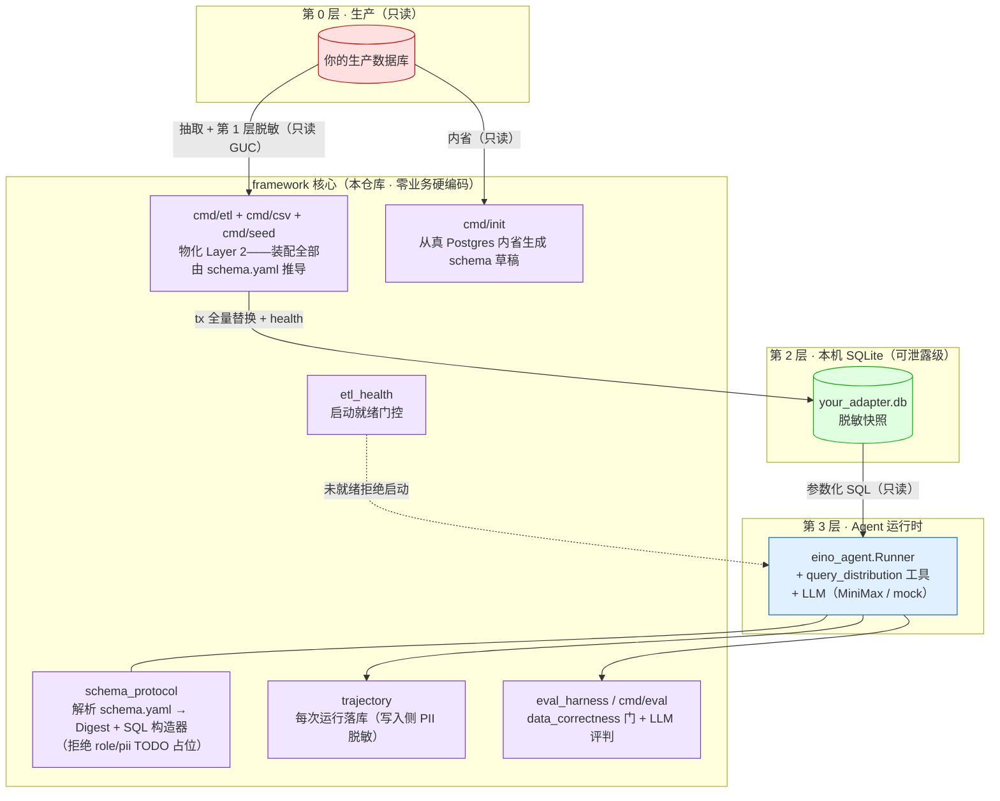

# schema-driven-insight-agent

[English](README.md) | **简体中文**

**一个 schema 驱动的数据洞察 AI Agent 框架。** 只需写一份 `schema.yaml` + 一份 db 配置——**零 Go 代码**，就能让 Agent 用自然语言回答运营问题——既给出分布表格，又给出**主动洞察**，且**永不直连你的生产数据库**。

> 为游戏运营分析而生，但框架核心**零业务硬编码**——所有领域知识都在 adapter 的 `schema.yaml` 里。换一份 schema，就得到一个新分析师。

---

## 为什么是它

市面上「和你的数据对话」的工具，要么 (a) 让 LLM 直接对生产库写裸 SQL（不安全、不可审计），要么 (b) 把单一 schema 写死（不可移植）。本框架走第三条路：

- **Schema 驱动、零业务硬编码** —— 引擎对你的业务**一无所知**。一份 `schema.yaml` 声明表、列、role（语义角色）、PII 标记、分布桶。同一个二进制服务任意 adapter。
- **三层数据流** —— Agent 只读取本地、已脱敏的 SQLite 快照，**绝不**连接生产 Postgres。
- **结构化工具，而非自由 SQL** —— Agent 调用参数化的 `query_distribution` 工具（列/桶白名单），SQL 由框架构造，LLM 不写 SQL。
- **主动洞察** —— 不止给分布表格，还主动指出运营要点（流失断崖、巨鲸集中度、分服倾斜）。
- **Trajectory + Eval 从第一天就在** —— 每次运行都被记录；Eval 评测道以 `data_correctness` 确定性把关。

## 快速开始（30 秒，无需 API key、无需数据库）

```bash
git clone https://github.com/RuntianLee/schema-driven-insight-agent
cd schema-driven-insight-agent

# 1. Build a de-identified Layer-2 snapshot from a real CC0 CSV (zero Go, no PG).
#    CustomerId is hashed and Surname dropped — all derived from schema.yaml.
go run ./cmd/csv -schema examples/bankchurn/schema.yaml

# 2. Ask the agent a question
SCHEMA_PATH=examples/bankchurn/schema.yaml \
SQLITE_PATH=examples/bankchurn/data/churn.db \
ETL_HEALTH_PATH=examples/bankchurn/data/etl_health.json \
go run ./cmd/agent -q "银行客户的账户余额分布是怎样的？"

# 3. Run the deterministic eval gate (no API key needed)
go run ./cmd/eval -schema examples/bankchurn/schema.yaml \
  -tasks examples/bankchurn/eval/tasks -db examples/bankchurn/data/churn.db
```

`examples/bankchurn` 是一个**真实**公开数据集（Kaggle 银行客户流失，CC0，10k 行），**零 Go** 即可接入——仅需 `schema.yaml`。如果偏好合成数据，或手头暂无 CSV，`examples/toygame` 演示了声明式 `cmd/seed` 路径：`go run ./cmd/seed -schema examples/toygame/schema.yaml -spec examples/toygame/seed.yaml`。

未设置 `MINIMAX_API_KEY` 时，回答会回退到无状态 **mock 占位**——工具/SQL 路径仍在真实数据上执行，但 mock 回复不会渲染它。配置一个 provider key（见 `config/llm.example.yaml`）即可在回答里得到真实的**分布表格**和主动洞察。

## 架构

核心纪律：**Agent 永不触碰生产，数据只能自下而上流。**



**读图**：Agent 只能触及绿色的「可泄露级」SQLite 层。脱敏发生在通用 `cmd/etl` 内部（第 1 层）——其全部装配（列集、货币 pivot、索引、盐、行数闸门）由你的 `schema.yaml` 推导，所以第 2 层天然合规，且没有任何 adapter 代码需要审计。框架从 schema 构造每一条 SQL（列/运算符白名单）——LLM 从不产出 SQL。

## 工作原理

1. **写一份 `schema.yaml`**，声明你的 `state_tables`（列、`role`、`pii`、`omit_in_layer2`）、`glossary.buckets`（分布分段）和一个 `etl_policy` 块——或让 **`cmd/init`** 内省你的 Postgres 自动生成草稿（role/pii 留 TODO 占位，解析器在你完成标注前拒绝运行：「忘标 PII」在机制上不可能）。
2. **零 Go 物化一份 Layer-2 SQLite 快照**——用 `cmd/etl` 对准真 Postgres（只读抽取、在途脱敏），用 `cmd/csv` 对准 CSV 文件（如 Kaggle 导出——与 Postgres 路径完全相同的脱敏方式，见 `examples/bankchurn`），或用 `cmd/seed` 对准声明式 `seed.yaml`（合成数据，见 `examples/toygame`）。三条入口，一个统一连接。无需写任何 adapter 代码。
3. **跑 Agent**，对着这份快照提问。它把你的 schema 解析成「Digest」（告诉 LLM 能问什么），把工具调用经白名单 SQL 构造器路由，再叙述结果。

仓库自带两个可跑的示例，均为纯 YAML（零 Go）：[`examples/bankchurn`](examples/bankchurn) —— 通过 CSV 车道接入的**真实** CC0 数据集（从这里开始）——以及 [`examples/toygame`](examples/toygame)，通过 `cmd/seed` 车道接入的合成挂机游戏。

## 写你自己的 adapter

见 **[docs/ADAPTER_GUIDE.zh-CN.md](docs/ADAPTER_GUIDE.zh-CN.md)** —— 以 `examples/toygame` 为脚手架的一步步教程。

## 仓库结构

```
schema_protocol/   schema.yaml 解析器（etl_policy / index / TODO 安全闸）+ Digest + 白名单 SQL 构造器
tools/             query_distribution 工具（Agent 唯一的数据工具）
eino_agent/        Agent runner（LLM tool-calling 循环）
agent/             Agent 契约（接口；与引擎无关）
contract/          响应类型（分布行、profile）
etl/               通用 ETL：schema 推导装配（derive）+ 编排（RunAll）
etl/seedgen/       声明式合成数据生成器（seed.yaml → 确定性快照）
etl/csvload/       CSV 文件 → 脱敏 Layer-2（镜像 seedgen；自带 CSV 即可用）
etl/introspect/    Postgres 内省 + 接入草稿渲染（cmd/init 核心）
etl_health/        启动就绪门控（min_rows / frozen / data_as_of）
trajectory/        运行记录（写入侧 PII 脱敏）
eval_harness/      评测引擎：data_correctness + LLM-judge；evalcli 共享装配 + 任务内联 fixture
llm/               LLM 客户端解析（MiniMax；mock 回退）
prompts/           方法论 system prompt（不含业务数据）
cmd/init/          从真 Postgres 内省生成 adapter 草稿（TODO 占位）
cmd/etl/           通用 ETL runner——装配全部由 schema.yaml 推导，零 adapter 代码
cmd/seed/          按声明式 seed.yaml 生成合成 Layer-2 快照（无需数据库）
cmd/csv/           从 CSV 文件生成 Layer-2 快照（零 Go；将 CSV 视为 Layer-1 并脱敏）
cmd/agent/         CLI 入口（REPL + 单发）
cmd/eval/          eval 任务集运行器（确定性 CI gate；gate 失败退出码 1；-mode ab 为 off-gate reflection A/B 度量）
cmd/eval-trend/    从 eval-history.jsonl 渲染跨版本趋势 HTML（零依赖，内联 SVG）
examples/toygame/  可跑的合成示例 adapter——纯 YAML、零 Go
examples/bankchurn/  可跑的真实示例 adapter（Kaggle 银行客户流失，CC0）——纯 YAML、零 Go（从这里开始）
```

## 安全模型

框架保证什么、信任边界在哪里：

- **`schema.yaml` 是信任边界。** 它由 adapter 开发者编写、按可信输入对待——但仍做防御性校验：表/列名必须匹配 `^[A-Za-z_][A-Za-z0-9_]*$`，bucket label 转义后才 inline，所有标识符过 schema 白名单才进 SQL。
- **LLM 永不产出 SQL。** 它只产出结构化 tool 参数；SQL 由框架构造，filter 值走 `?` 占位符绑定，比较运算符走固定白名单。
- **PII 三个面共用一条规则。** 标 `pii` / `omit_in_layer2` 的列：查询构造时前置拒绝、不物化进 Layer2、不出现在喂给 LLM 的 schema 摘要——查询面 = 物化面 = 暴露面。
- **Agent 永不直连生产库。** 只读 Layer-2 SQLite 快照；ETL 侧只读连接（`default_transaction_read_only` + 语句超时）。
- **Trajectory 写入侧脱敏**（问题、step、最终输出），`trajectory.db` 已 gitignore。API key 走环境变量 / gitignore 的配置文件，全程不落日志。
- **已知注入面：** tool 结果（含 DB 文本列的 `CAST AS TEXT` 值）会回注进 LLM 对话。纯数值游戏数据无虞；若你的 adapter 暴露用户生成的 TEXT 列（昵称、签名），其内容会进入 prompt——请将此类列标 `pii`/`omit_in_layer2`，或有意暴露并把叙述结果按不可信内容对待。

## 状态

早期开源版本。框架核心稳定，但在打出 `v1` tag 前 API 仍可能演进。针对真实数据集的 adapter（及其数据）**刻意不**纳入本仓库。

## License

MIT —— 见 [LICENSE](LICENSE)。adapter 层与任何真实数据都在本仓库之外。
