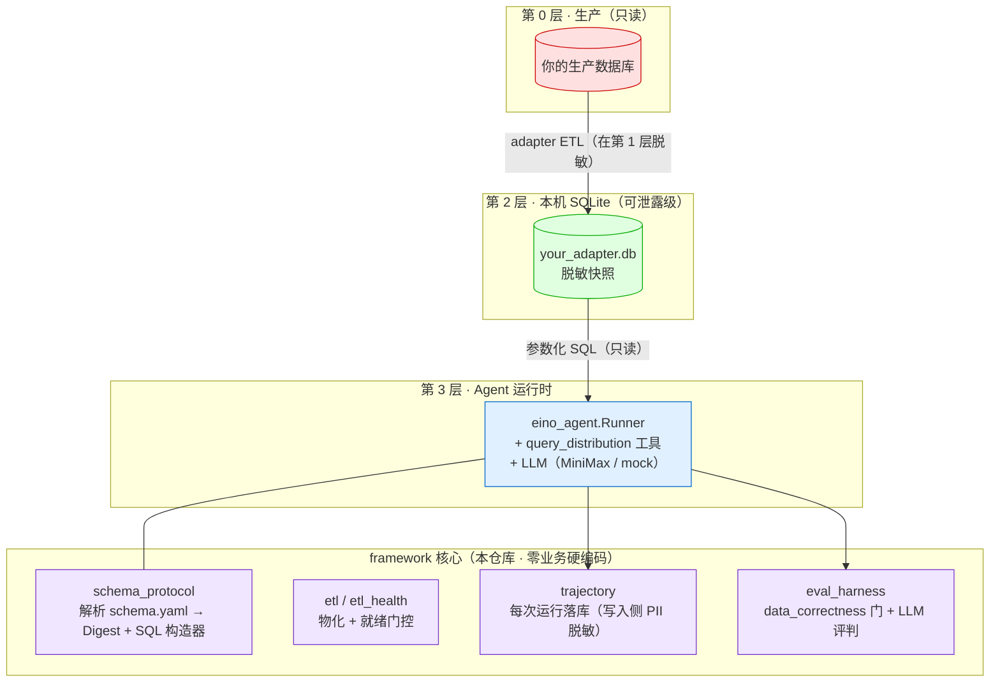

# schema-driven-insight-agent

[English](README.md) | **简体中文**

**一个 schema 驱动的数据洞察 AI Agent 框架。** 只需写一份 `schema.yaml` + 一个薄 adapter，就能让 Agent 用自然语言回答运营问题——既给出分布表格，又给出**主动洞察**，且**永不直连你的生产数据库**。

> 为游戏运营分析而生，但框架核心**零业务硬编码**——所有领域知识都在 adapter 的 `schema.yaml` 里。换一份 schema，就得到一个新分析师。

---

## 为什么是它

市面上「和你的数据对话」的工具，要么 (a) 让 LLM 直接对生产库写裸 SQL（不安全、不可审计），要么 (b) 把单一 schema 写死（不可移植）。本框架走第三条路：

- **Schema 驱动、零业务硬编码** —— 引擎对你的业务**一无所知**。一份 `schema.yaml` 声明表、列、role（语义角色）、PII 标记、分布桶。同一个二进制服务任意 adapter。
- **三层数据流** —— Agent 只读取本地、已脱敏的 SQLite 快照，**绝不**连接生产 Postgres。
- **结构化工具，而非自由 SQL** —— Agent 调用参数化的 `query_distribution` 工具（列/桶白名单），SQL 由框架构造，LLM 不写 SQL。
- **主动洞察** —— 不止给分布表格，还主动指出运营要点（流失断崖、巨鲸集中度、分服倾斜）。
- **Trajectory + Eval 从第一天就在** —— 每次运行都被记录；Eval 评测道以 `data_correctness` 确定性把关。

## 快速开始（30 秒，无需 API key、无需数据库）

```bash
git clone https://github.com/RuntianLee/schema-driven-insight-agent
cd schema-driven-insight-agent/examples/toygame

# 1. 生成一份合成 Layer-2 快照（1000 个假玩家，纯 Go，无需 PG）
go run ./cmd/seed

# 2. 向 Agent 提问（从仓库根目录跑，默认路径才能命中）
cd .. && cd ..
go run ./cmd/agent -q "玩家的金币余额分布是怎样的？"
```

未设置 `MINIMAX_API_KEY` 时，回答会回退到无状态 **mock 占位**——工具/SQL 路径仍在真实合成数据上执行，但 mock 回复不会渲染它。配置一个 provider key（见 `config/llm.example.yaml`）即可在回答里得到真实的**分布表格**和主动洞察。

## 架构

核心纪律：**Agent 永不触碰生产，数据只能自下而上流。**



**读图**：Agent 只能触及绿色的「可泄露级」SQLite 层。脱敏发生在 adapter 的 ETL（第 1 层），所以第 2 层天然合规。框架从 schema 构造每一条 SQL（列/运算符白名单）——LLM 从不产出 SQL。

## 工作原理

1. **写一份 `schema.yaml`**，声明你的 `state_tables`（列、`role`、`pii`、`omit_in_layer2`）和 `glossary.buckets`（分布分段）。
2. **写一个薄 adapter**，把数据物化成一份 Layer-2 SQLite 快照——要么真 Postgres ETL（`framework/etl` 有只读 pgx 辅助），要么合成 seed（见 `examples/toygame`）。通常**不到 200 行**。
3. **跑 Agent**，对着这份快照提问。它把你的 schema 解析成「Digest」（告诉 LLM 能问什么），把工具调用经白名单 SQL 构造器路由，再叙述结果。

仓库自带一个完整、可跑的示例：[`examples/toygame`](examples/toygame) —— 一个用合成数据的虚构挂机游戏。把它当作你自己 adapter 的模板。

## 写你自己的 adapter

见 **[docs/ADAPTER_GUIDE.zh-CN.md](docs/ADAPTER_GUIDE.zh-CN.md)** —— 以 `examples/toygame` 为脚手架的一步步教程。

## 仓库结构

```
schema_protocol/   schema.yaml 解析器 + Digest + 白名单 SQL 构造器
tools/             query_distribution 工具（Agent 唯一的数据工具）
eino_agent/        Agent runner（LLM tool-calling 循环）
agent/             Agent 契约（接口；与引擎无关）
contract/          响应类型（分布行、profile）
etl/ etl_health/   通用 ETL 辅助 + 启动就绪门控
trajectory/        运行记录（写入侧 PII 脱敏）
eval_harness/      评测引擎：data_correctness + LLM-judge 评测器
llm/               LLM 客户端解析（MiniMax；mock 回退）
prompts/           方法论 system prompt（不含业务数据）
cmd/agent/         CLI 入口（REPL + 单发）
examples/toygame/  可跑的合成示例 adapter（从这里开始）
```

## 状态

早期开源版本。框架核心稳定，但在打出 `v1` tag 前 API 仍可能演进。针对真实数据集的 adapter（及其数据）**刻意不**纳入本仓库。

## License

MIT —— 见 [LICENSE](LICENSE)。adapter 层与任何真实数据都在本仓库之外。
